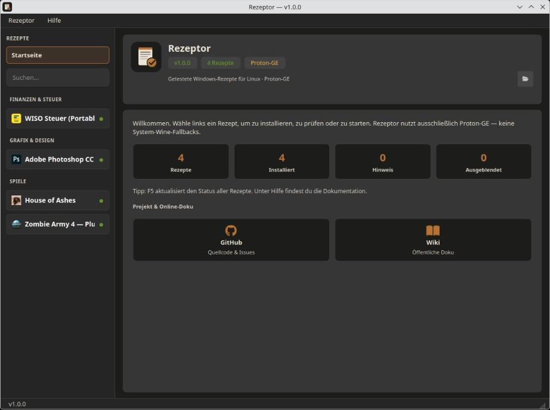

<p align="center">
  
</p>

# Rezeptor

**Windows-Software unter Linux installieren und starten** — mit getesteten Rezepten, **Proton-GE** und einer einfachen Desktop-Oberfläche.

Photoshop, Steuerprogramme (WISO), Steam-Spiele mit Online-Fix, Trainer und mehr: Jedes Rezept weiß, wie Installation, Reparatur, Prüfung, Start und saubere Deinstallation funktionieren.

[](https://benjarogit.github.io/rezeptor/)
[](LICENSE)
[](https://github.com/benjarogit/rezeptor/releases)

> **Nachfolgeprojekt.**  
> Weiterentwicklung nur noch hier. Die älteren Repositories
> [photoshopCClinux](https://github.com/benjarogit/photoshopCClinux),
> [wiso-steuer-portable-linux](https://github.com/benjarogit/wiso-steuer-portable-linux) und
> [crkcachy](https://github.com/benjarogit/crkcachy)
> sind archiviert — Issues und PRs bitte in **diesem** Repo öffnen.

## Was du bekommst

- **GUI-Launcher** — Rezept wählen, installieren, starten, reparieren oder entfernen
- **Nur Proton-GE** — kein System-Wine-Fallback in Rezepten
- **Statusprüfung** — optional beim Start; jederzeit neu prüfen (F5)
- **System-Tools** — fehlende Pakete einmalig vorschlagen
- **Katalog & Quellen** — offizielle Rezepte plus Community-Pfad
- **Daten unter** `~/.local/share/wine-software/`



## Schnellstart

```bash
git clone https://github.com/benjarogit/rezeptor.git
cd rezeptor
./setup.sh
```

Benötigt **PyQt6** auf dem Host (`python-pyqt6` unter Arch/CachyOS bzw. Distro-Paket) bei **Git-Clone** oder **`tar.gz`**-Release (`./setup.sh`).

Das **`AppImage`** bringt eigenes Python und PyQt6 mit — kein hostseitiges `python-pyqt6` nötig (empfohlen auf Bazzite und anderen immutable Distros).

Das **`Flatpak`** bringt Python, PyQt6 und Proton-GE ebenfalls mit. Installation aus dem Release-Bundle:

```bash
flatpak install --user rezeptor-<version>-x86_64.flatpak
flatpak run io.github.benjarogit.Rezeptor
```

Oder lokal bauen: `scripts/build-flatpak.sh` (benötigt `flatpak-builder`).

Oder ein **[Release](https://github.com/benjarogit/rezeptor/releases)** (`tar.gz`, AppImage oder Flatpak). Portable Builds prüfen mit `sha256sum -c SHA256SUMS` (tar.gz + AppImage).

## Dokumentation

### → [Rezeptor Docs](https://benjarogit.github.io/rezeptor/)

- [Deutsch](https://benjarogit.github.io/rezeptor/) · [English](https://benjarogit.github.io/rezeptor/en/)
- Lokal: `pip install -r requirements-docs.txt && mkdocs serve`

## Rezepte

| Ort | Rolle |
|-----|--------|
| `recipes/<id>/` | Mitgeliefert / offiziell |
| `recipes/community/<id>/` | Community |

Ideen einreichen über [Recipe Submission](https://github.com/benjarogit/rezeptor/issues/new?template=recipe_submission.md).

## Versionierung

Releases folgen **SemVer** (`MAJOR.MINOR.PATCH`). Aktuelle Linie ab **1.0.2**.

## English

→ [README.md](README.md) · [Documentation](https://benjarogit.github.io/rezeptor/en/README/)

## Lizenz

GPL-2.0 — siehe [LICENSE](LICENSE).
