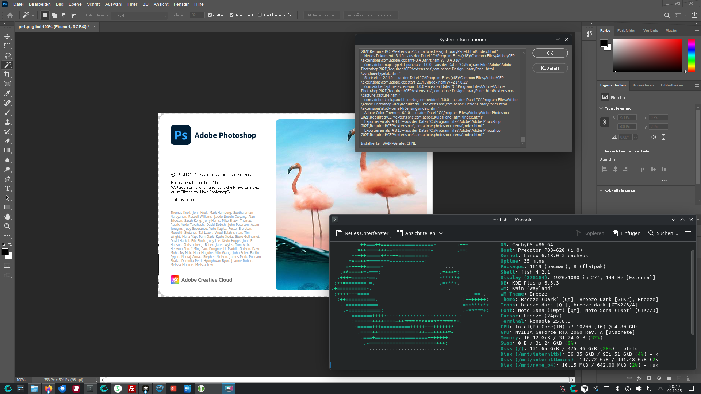
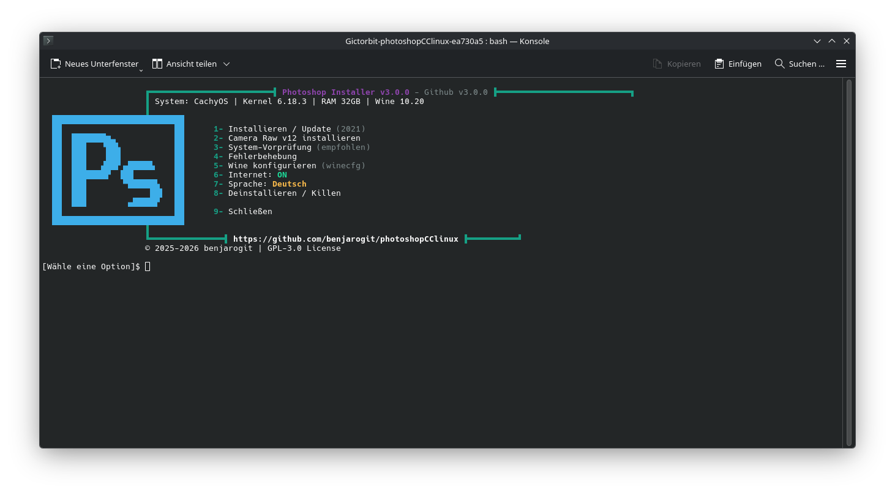

# Adobe Photoshop Installer für Linux 

> [!NOTE]
> **Produktionsreif - Komplettes Toolset**
> 
> Dieses Projekt hat sich von einem einfachen Installer zu einem **umfassenden, produktionsreifen Toolset** für Photoshop auf Linux entwickelt. Mit modularer Architektur, umfangreichen Features und professionellem Finish ist es bereit für den breiten Einsatz.
> 
> **Jeder Hinweis, Fix oder Idee ist willkommen!** Bitte melde Probleme, teile Lösungen oder trage Verbesserungen über [GitHub Issues](https://github.com/benjarogit/photoshopCClinux/issues) bei.
> 
> Siehe [CHANGELOG.md](CHANGELOG.md) für aktuelle Änderungen!

> [!IMPORTANT]
> **Getestete und funktionierende Versionen**
> 
> ✅ **Adobe Photoshop CC 2021 (v22.x)** wurde erfolgreich getestet mit **Wine Standard** Installationsmethode.
> 
> **Hinweis zu Versionsnummern**: Die von mir getestete spezifische Version ist **v22.0.0.35**, aber **jede Photoshop v22.x Version sollte funktionieren**. Die genaue Build-Nummer kann variieren, je nachdem woher du deine Installationsdateien hast.
> 
> 💡 **Empfehlung**: Versuche die Installation mit welcher Photoshop-Version auch immer du zur Verfügung hast. Wenn du CC 2021 (v22.x) hast, sollte es gut funktionieren!
> 
> 
> ✅ **Getestet auf**: CachyOS Linux (Arch-basiert) mit KDE Desktop-Umgebung
> 
> ⚠️ **Bekanntes Problem**: Icon-Anzeigeproblem in KDE Desktop-Umgebung - Icons erscheinen möglicherweise nicht im Startmenü oder Desktop-Verknüpfung. Workaround: Desktop-Sitzung neu starten oder abmelden und wieder anmelden.



     

**Adobe Photoshop nativ auf Linux mit Wine ausführen**

Ein einfacher, automatisierter Installer, der dir hilft, Photoshop auf Linux einzurichten. Funktioniert auf CachyOS, Arch, Ubuntu, Fedora und allen großen Linux-Distributionen.

---

## 🌍 Sprachen / Languages

- 🇩🇪 **Deutsche Dokumentation** - Diese Seite
- 🇬🇧 **[English Documentation](README.md)** - Vollständige Anleitung

---

# Deutsche Dokumentation

## 📋 Inhaltsverzeichnis

- [Features](#-features)
- [Systemanforderungen](#️-systemanforderungen)
- [Wichtiger Hinweis](#️-wichtiger-hinweis)
- [Schnellstart](#-schnellstart)
- [Installationsanleitung](#-installationsanleitung)
- [Bekannte Probleme & Lösungen](#-bekannte-probleme--lösungen)
- [Fehlerbehebung](#-fehlerbehebung)
- [Performance-Tipps](#-performance-tipps)
- [Deinstallation](#-deinstallation)
- [Mithelfen](#-mithelfen)
- [Lizenz](#-lizenz)

---

## ✨ Features

### Kern-Installation
- ✅ **Lokale Installation** - Verwendet lokale Installationsdateien (keine Downloads von Adobe)
- ✅ **Automatisches Setup** - Installiert Wine-Komponenten und Abhängigkeiten automatisch
- ✅ **Multi-Distribution Support** - Funktioniert auf CachyOS, Arch, Ubuntu, Fedora und mehr
- ✅ **Vorinstallationsprüfung** - Validiert System vor Installation mit distro-spezifischen Hinweisen
- ✅ **Desktop-Integration** - Erstellt Menüeintrag und Terminal-Befehl
- ✅ **Mehrsprachig** - Vollständige i18n-Unterstützung (DE/EN) mit externen Sprachdateien

### Erweiterte Features
- 🔧 **Automatische Fehlerbehebung** - Eingebaute Diagnosetools mit automatischen Fixes
- 📦 **Camera Raw Installer** - Automatisierte Installation mit MD5-Verifikation
- 🔄 **Update-Check-System** - GitHub API-Integration mit Caching und Timeout-Schutz
- 💾 **Checkpoint/Rollback** - Sichere Installation mit Wiederherstellungspunkten
- 🔒 **Security-Modul** - Pfad-Validierung, sichere Operationen, Shell-Injection-Prävention
- 📊 **System-Informationen** - Cross-Distro System-Erkennung und -Berichte
- 🎨 **Responsive UI** - Banner, Boxen und Header passen sich Terminal-Breite an
- 🔇 **Quiet/Verbose Modi** - `--quiet` / `-q` und `--verbose` / `-v` Flags für CI/Testing
- 📝 **Log-Rotation** - Automatische Kompression (gzip) und Bereinigung alter Logs
- 🚀 **Datei-Öffnen-Support** - Launcher akzeptiert Dateien als Parameter ("Mit Photoshop öffnen")
- ⚙️ **Wine-Konfiguration** - Interaktiver winecfg-Launcher mit Tipps
- 🛑 **Kill-Photoshop Utility** - Zwangsbeendigung hängender Prozesse
- 🎯 **GPU-Workarounds** - Fixes für häufige Grafikprobleme

---

## 🖥️ Systemanforderungen

### Erforderlich

- **OS:** 64-bit Linux Distribution
- **RAM:** Minimum 4 GB (8 GB empfohlen)
- **Speicher:** 5 GB freier Speicherplatz in `/home`
- **Grafik:** Beliebige GPU (Intel, Nvidia, AMD) mit aktuellen Treibern

### Erforderliche Pakete

<details>
<summary><b>CachyOS / Arch Linux</b></summary>

```bash
sudo pacman -S wine winetricks
``` 
</details>

<details>
<summary><b>Ubuntu / Debian / Linux Mint</b></summary>

```bash
sudo apt install wine winetricks
```
</details>

<details>
<summary><b>Fedora / RHEL</b></summary>

```bash
sudo dnf install wine winetricks
```
</details>

<details>
<summary><b>openSUSE</b></summary>

```bash
sudo zypper install wine winetricks
```
</details>

---

## ⚠️ Wichtiger Hinweis

### Du musst Photoshop-Installationsdateien selbst bereitstellen

**Dieses Repository enthält KEINE Photoshop-Installationsdateien.**

Du musst:
1. **Eine gültige Adobe Photoshop CC 2019 Lizenz besitzen**
2. **Den Installer selbst beschaffen** (siehe [Wie bekomme ich Photoshop?](#wie-bekomme-ich-photoshop-dateien))
3. **Dateien im `photoshop/` Verzeichnis platzieren** (siehe [photoshop/README.md](photoshop/README.md))

### ⚡ Versions-Kompatibilität

**Dieser Installer ist für Photoshop CC 2019 (v20.x) optimiert.**

Laut [Wine AppDB](https://appdb.winehq.org/objectManager.php?iId=17&sClass=application) haben verschiedene Photoshop-Versionen unterschiedliche Kompatibilität:

- ✅ **CC 2019 (v20.0)** - Funktioniert mit Workarounds (GPU deaktiviert) - **Dieser Installer**
- ⚠️ **CC 2024** - Eingeschränkte Unterstützung, viele GPU-Probleme
- 🏆 **CS3-CS6** - Bessere Wine-Kompatibilität, aber ältere Features
- ❌ **CC 2020+** - Erhöhte Online-Anforderungen, nicht empfohlen

**Warum CC 2019?**
- Letzte Version vor starker Creative Cloud Integration
- Gutes Feature-Set für professionelle Arbeit
- Funktioniert zuverlässig mit deaktivierter GPU
- Offline-Installation möglich

**Alternative Versionen:**
Falls du Zugriff auf ältere Versionen hast, haben **Photoshop CS6 (13.0)** oder **CS3 (10.0)** bessere Wine-Bewertungen (Silver/Platinum), aber weniger moderne Features.

### Wie bekomme ich Photoshop-Dateien?

#### Option 1: Offiziell von Adobe (Empfohlen)
- Download über Adobe Creative Cloud
- Offline-Installer für Photoshop CC 2019 (v20.x) verwenden

#### Option 2: Von vorhandener Windows-Installation
- Falls du Photoshop unter Windows hast, extrahiere die Installationsdateien
- Windows-Pfad: `C:\Program Files\Adobe\Adobe Photoshop CC 2019\`

**⚖️ Legal:** Du benötigst eine gültige Lizenz. Dieses Script automatisiert nur die Wine-Installation.

---

## 🚀 Schnellstart

### 1. Repository klonen

```bash
git clone https://github.com/benjarogit/photoshopCClinux.git
cd photoshopCClinux
```

### 2. Photoshop-Dateien platzieren

Kopiere deine Photoshop CC 2019 Installationsdateien in das `photoshop/` Verzeichnis:

```
photoshop/
├── Set-up.exe
├── packages/
└── products/
```

Siehe [photoshop/README.md](photoshop/README.md) für detaillierte Struktur.

### 3. Vorprüfung ausführen

```bash
chmod +x pre-check.sh
./pre-check.sh
```

Sollte anzeigen: ✅ "Alle kritischen Checks bestanden!"

### 4. Internet deaktivieren (Empfohlen)

```bash
# WLAN
nmcli radio wifi off

# Oder Ethernet
sudo ip link set <interface> down
```

Dies verhindert Adobe-Login-Aufforderungen während der Installation.

### 5. Installation ausführen

```bash
chmod +x setup.sh
./setup.sh
```

### 6. Im Menü Option 1 wählen

```
┌─────────────────────────────────────────────┐
│  1- Installieren / Update                   │
│  2- Camera Raw v12 installieren             │
│  3- System-Vorprüfung (empfohlen)           │
│  4- Fehlerbehebung                          │
│  5- Wine konfigurieren                      │
│  6- Internet: ON (Toggle)                   │
│  7- Sprache: Deutsch (L)                    │
│  8- Deinstallieren / Killen                │
│  9- Schließen                               │
└─────────────────────────────────────────────┘
```

Wähle **Option 1** (Installieren / Update)



### 7. Im Adobe Setup-Fenster

- Klicke auf "Installieren"
- Behalte den Standard-Pfad (`C:\Program Files\Adobe\...`)
- Wähle deine Sprache (z.B. de_DE oder en_US)
- Warte 10-20 Minuten

### 8. Internet wieder aktivieren

```bash
nmcli radio wifi on
```

### 9. Photoshop starten

```bash
photoshop
```

Oder suche nach "Adobe Photoshop CC" in deinem Anwendungsmenü.

### 10. GPU deaktivieren (Wichtig!)

Für Stabilität:
1. In Photoshop: `Bearbeiten > Voreinstellungen > Leistung` (Strg+K)
2. Deaktiviere "Grafikprozessor verwenden"
3. Starte Photoshop neu

---

## ⚙️ Befehlszeilen-Optionen

Der Installer unterstützt mehrere Befehlszeilen-Flags für Automatisierung und Debugging:

- `--wine-standard`: Wine Standard verwenden (überspringt interaktive Wine-Auswahl)
- `--quiet` / `-q`: Quiet-Modus - unterdrückt alle Ausgaben außer Fehlern (nützlich für CI/Testing)
- `--verbose` / `-v`: Verbose-Modus - zeigt Debug-Logs auf der Konsole (nützlich für Debugging)

### Beispiele

```bash
# Standard-Installation mit Wine Standard (nicht-interaktiv)
./setup.sh --wine-standard

# Quiet-Installation (für CI/Testing - nur Fehler werden angezeigt)
./setup.sh --quiet --wine-standard

# Verbose-Installation (für Debugging - zeigt alle Debug-Logs)
./setup.sh --verbose --wine-standard

# Flags kombinieren
./setup.sh --quiet --wine-standard
```

**Hinweis:** Alle Ausgaben werden auch im Quiet-Modus in Dateien protokolliert. Prüfe `~/.photoshop/logs/` für detaillierte Logs.

---

## 📖 Installationsanleitung

### Detaillierte Schritte

#### Vor der Installation

1. **Erforderliche Pakete installieren**
   ```bash
   # CachyOS/Arch
   sudo pacman -S wine winetricks
   
   # Ubuntu/Debian
   sudo apt install wine winetricks
   ```

2. **System prüfen**
   ```bash
   ./pre-check.sh
   ```
   
   Dies validiert:
   - 64-bit Architektur
   - Wine/winetricks Installation
   - Verfügbarer Speicherplatz
   - RAM
   - Vorhandensein der Installationsdateien

#### Während der Installation

1. **Wine-Konfiguration**
   - Mono-Installer erscheint → Klicke "Installieren"
   - Gecko-Installer erscheint → Klicke "Installieren"
   - Wine-Config-Fenster → Auf Windows 10 setzen, OK klicken

2. **Komponenten-Installation** (automatisch, ~10 Minuten)
   - vcrun2010, vcrun2012, vcrun2013, vcrun2015
   - Schriftarten und Font-Smoothing
   - msxml3, msxml6, gdiplus

3. **Adobe Photoshop Setup** (10-20 Minuten)
   - Adobe Installer-Fenster erscheint
   - Klicke "Installieren"
   - Wähle Sprache
   - Warte auf Abschluss
   - **Ignoriere** "ARKServiceAdmin" Fehler falls sie erscheinen

#### Nach der Installation

1. **Fehlerbehebung ausführen**
   ```bash
   ./troubleshoot.sh
   ```

2. **Photoshop starten**
   ```bash
   photoshop
   ```
   
   Erster Start dauert 1-2 Minuten (normal!)

3. **GPU deaktivieren**
   - Bearbeiten > Voreinstellungen > Leistung
   - Deaktiviere "Grafikprozessor verwenden"

---


---

## 🐛 Bekannte Probleme & Lösungen

### Problem 1: Photoshop stürzt beim Start ab

**Ursache:** GPU-Beschleunigung Inkompatibilität mit Wine

**Lösung:**
```
1. Starte Photoshop
2. Bearbeiten > Voreinstellungen > Leistung (Strg+K)
3. Deaktiviere "Grafikprozessor verwenden"
4. Deaktiviere "OpenCL verwenden"
5. Starte Photoshop neu
```

### Problem 2: "VCRUNTIME140.dll fehlt"

**Ursache:** Visual C++ Runtime nicht korrekt installiert

**Lösung:**
```bash
WINEPREFIX=~/.photoshop/prefix winetricks vcrun2015
```

### Problem 3: Liquify-Tool funktioniert nicht

**Ursache:** GPU/OpenCL-Probleme

**Lösung:**
- GPU-Beschleunigung deaktivieren (siehe Problem 1)
- Oder OpenCL deaktivieren: Voreinstellungen > Leistung > Deaktiviere "OpenCL verwenden"

### Problem 4: Verschwommene/Hässliche Schriftarten

**Lösung:**
```bash
WINEPREFIX=~/.photoshop/prefix winetricks fontsmooth=rgb
```

### Problem 5: Installation hängt bei 100%

**Lösung:**
- Warte 2-3 Minuten
- Falls nichts passiert, schließe Installer (Alt+F4)
- Installation ist wahrscheinlich abgeschlossen
- Überprüfe: `ls ~/.photoshop/prefix/drive_c/Program\ Files/Adobe/`

### Problem 6: "ARKServiceAdmin" Fehler während Installation

**Lösung:**
- Dieser Fehler kann **ignoriert** werden
- Klicke "Ignorieren" oder "Fortfahren"
- Installation wird erfolgreich abgeschlossen

### Problem 7: Langsamer erster Start (1-2 Minuten)

**Kein Problem:**
- Erster Start ist immer langsam
- Weitere Starts dauern 10-30 Sekunden
- Dies ist normales Wine-Verhalten

### Problem 8: Kann nicht als PNG speichern

**Ursache:** Dateiformat-Plugin-Problem in Wine

**Lösung:**
```
1. Datei > Speichern unter
2. Wähle "PNG" aus Format-Dropdown
3. Falls Fehler: Datei > Exportieren > Exportieren als > PNG
4. Alternative: Als PSD speichern, dann mit GIMP als PNG exportieren
```

### Problem 9: Bildschirm aktualisiert nicht sofort (Rückgängig/Wiederholen)

**Ursache:** Wine Rendering-Verzögerung

**Lösung:**
- Dies ist eine bekannte Wine-Einschränkung
- Workaround: Aktualisierung erzwingen mit Strg+0 (An Bildschirm anpassen)
- Oder: Virtual Desktop in winecfg aktivieren

### Problem 10: Zoom ist träge

**Ursache:** GPU-Beschleunigung deaktiviert + Wine-Overhead

**Lösung:**
```
1. Verwende Tastenkürzel (Strg + / Strg -)
2. Zoom mit Mausrad ist langsamer als nativ
3. Dies ist erwartetes Verhalten mit Wine
4. Performance ist besser mit wine-staging
```

### Problem 11: Adobe Installer "Weiter"-Button reagiert nicht

**Ursache:** Adobe Installer verwendet Internet Explorer Engine (mshtml.dll), die in Wine nicht perfekt funktioniert

**Lösung:**
```
1. Installiere IE8 wenn gefragt (dauert 5-10 Minuten, hilft aber erheblich)
2. Warte 15-30 Sekunden - Installer lädt manchmal langsam
3. Verwende Tastaturnavigation:
   - Tab-Taste mehrmals drücken, um Button zu fokussieren
   - Enter drücken zum Klicken
   - Oder: Alt+W (Weiter) / Alt+N (Next)
4. Klicke direkt auf den Button (nicht daneben)
5. Installer-Fenster in den Vordergrund bringen (Alt+Tab)
6. Falls nichts hilft: Versuche Wine-Komponenten mit winetricks neu zu installieren
```

**Hinweis:** Dies ist eine bekannte Einschränkung von Wine mit IE-basierten Installern. Der Installer hat bereits DLL-Overrides und Registry-Tweaks konfiguriert, um die Kompatibilität zu verbessern.

---

## 🔧 Fehlerbehebung

### Automatische Fehlerbehebung

```bash
./troubleshoot.sh
```

Dieses Tool:
- ✅ Prüft Systemanforderungen
- ✅ Validiert Installation
- ✅ Analysiert Wine-Konfiguration
- ✅ Scannt Logs nach Fehlern
- ✅ Wendet automatische Fixes an wenn möglich
- ✅ Bietet detaillierte Berichte

### Manuelle Fehlerbehebung

#### Logs prüfen

```bash
# Setup-Log
cat ~/.photoshop/setuplog.log

# Wine-Fehler
tail -n 50 ~/.photoshop/wine-error.log

# Runtime-Fehler
tail -n 30 ~/.photoshop/photoshop-runtime.log
```

#### Wine-Konfiguration

```bash
./setup.sh  # Wähle Option 5
```

Empfohlene Einstellungen:
- **Windows-Version:** Windows 10
- **DPI:** 96 (Standard)
- **Virtual Desktop:** Optional (aktivieren bei Vollbild-Problemen)

#### Komponenten neu installieren

```bash
WINEPREFIX=~/.photoshop/prefix winetricks --force vcrun2015 msxml6
```

---

## 🚀 Performance-Tipps

### Essentiell (Für Stabilität)

1. **GPU in Photoshop deaktivieren** (Strg+K → Leistung)
2. **OpenCL deaktivieren** (Strg+K → Leistung)

### Optional (Für Geschwindigkeit)

3. **Wine-Staging verwenden**
   ```bash
   # CachyOS/Arch
   sudo pacman -S wine-staging
   
   # Ubuntu
   sudo add-apt-repository ppa:cybermax-dexter/sdl2-backport
   sudo apt install wine-staging
   ```

4. **CSMT aktivieren**
   ```bash
   WINEPREFIX=~/.photoshop/prefix winetricks csmt
   ```

5. **Virtual Desktop verwenden** (bei Performance-Problemen)
   ```bash
   ./setup.sh  # Option 5 → Grafik → Virtual Desktop aktivieren
   ```

### Erwartete Performance

| Feature | Native Windows | Wine Linux | Notizen |
|---------|---------------|------------|---------|
| Basis-Tools | 100% | 90-95% | Ausgezeichnet |
| Filter | 100% | 80-90% | Gut |
| Liquify | 100% | 70-80% | Nutzbar (GPU aus) |
| 3D Features | 100% | 30-50% | Eingeschränkt |
| Camera Raw | 100% | 60-80% | Nutzbar |
| Startzeit | 5-10s | 10-30s | Nach erstem Start |

**Gesamt:** 85-90% der nativen Performance für Standard-Fotobearbeitung.

---

## 🗑️ Deinstallation

### Vollständige Entfernung

```bash
./setup.sh  # Wähle Option 6
```

Wenn du Option 6 auswählst, erscheint ein Untermenü:
- **Option 1**: Photoshop deinstallieren (vollständige Entfernung)
- **Option 2**: Photoshop Prozesse zwangsweise beenden (wenn Photoshop hängt/nicht reagiert)
- **Option 3**: Zurück zum Hauptmenü

**Option 1** entfernt:
- Wine-Prefix (`~/.photoshop/`)
- Desktop-Eintrag
- Terminal-Befehl (`/usr/local/bin/photoshop`)

**Option 2** beendet alle Photoshop- und Wine-Prozesse zwangsweise. Verwende dies, wenn Photoshop hängt oder nicht reagiert.

### Manuelle Entfernung

```bash
# Installation entfernen
rm -rf ~/.photoshop/

# Desktop-Eintrag entfernen
rm ~/.local/share/applications/photoshop.desktop

# Befehl entfernen
sudo rm /usr/local/bin/photoshop
```

---

## 🤝 Mithelfen

**Wir brauchen deine Hilfe!** Dieses Projekt wird durch Beiträge aus der Community besser.

### Wie du helfen kannst

#### 🐛 Fehler melden
Etwas funktioniert nicht? Lass es uns wissen!
- [Öffne ein GitHub Issue](https://github.com/benjarogit/photoshopCClinux/issues)
- Bitte angeben: Linux-Distribution, Wine-Version, Fehler-Logs, Schritte zur Reproduktion
- Auch wenn du dir nicht sicher bist - melde es trotzdem!

#### 💡 Features vorschlagen
Hast du eine Idee, wie wir das besser machen können?
- [Öffne einen Feature-Request](https://github.com/benjarogit/photoshopCClinux/issues)
- Beschreibe was du dir wünschst
- Erkläre warum es hilfreich wäre

#### 🔧 Fixes & Workarounds teilen
Eine Lösung für ein Problem gefunden?
- Teile sie in den [GitHub Issues](https://github.com/benjarogit/photoshopCClinux/issues)
- Hilf anderen mit dem gleichen Problem
- Deine Erfahrung hilft allen!

#### 📝 Dokumentation verbessern
Etwas in der README unklar gefunden?
- [Öffne ein Issue](https://github.com/benjarogit/photoshopCClinux/issues) oder sende einen Pull Request
- Hilf dabei, das für Anfänger einfacher zu machen
- Übersetze in andere Sprachen

#### 💻 Code beitragen
Möchtest du Code beitragen?
1. Forke das Repository
2. Erstelle einen Feature-Branch
3. Teste deine Änderungen gründlich
4. Sende einen Pull Request mit klarer Beschreibung

**Jeder Beitrag, groß oder klein, macht dieses Projekt besser! 🙏**

---

## 📚 Weitere Ressourcen

### Offizielle Ressourcen

- **English Documentation:** [README.md](README.md)
- **Changelog:** [CHANGELOG.md](CHANGELOG.md) - Siehe aktuelle Änderungen und vorherige Versionen
- **Schnellstart-Anleitung:** Schnellstart-Sektion oben
- **Wine AppDB:** [Photoshop on Wine](https://appdb.winehq.org/objectManager.php?iId=17&sClass=application)

### Alternative Lösungen

Falls dieser Installer für dich nicht funktioniert, erwäge diese Alternativen:

- **[PhotoGIMP](https://github.com/Diolinux/PhotoGIMP)** - GIMP konfiguriert wie Photoshop
- **[Krita](https://krita.org/)** - Professionelles Malen und Illustration (nativ Linux)
- **[Photopea](https://www.photopea.com/)** - Online Photoshop Alternative (Browser-basiert)
- **Ältere Photoshop Versionen** - CS6 oder CS3 haben bessere Wine-Kompatibilität (siehe Wine AppDB)

### Community & Hilfreiche Guides

- [How to Run Photoshop on Linux](https://www.linuxnest.com/how-to-run-photoshop-on-linux-an-ultimate-guide/)
- [Install Adobe Photoshop on Linux](https://thelinuxcode.com/install_adobe_photoshop_linux/)
- [Original Gictorbit Project](https://github.com/Gictorbit/photoshopCClinux)

---

## 📄 Lizenz

Dieses Projekt ist unter der **GPL-2.0 Lizenz** lizenziert - siehe die [LICENSE](LICENSE) Datei für Details.

### Rechtlicher Hinweis

- ⚠️ Adobe Photoshop ist proprietäre Software von Adobe Inc.
- ⚠️ Du benötigst eine gültige Lizenz um Photoshop zu verwenden
- ⚠️ Dieses Script automatisiert nur die Wine-Installation
- ⚠️ Keine Piraterie wird unterstützt oder gefördert
- ✅ Verwendung auf eigene Gefahr

---

## 🙏 Danksagungen

- **[Gictorbit](https://github.com/Gictorbit)** - Original Installer-Script
- **Wine Team** - Windows Kompatibilitätsschicht
- **Community Contributors** - Fehlerberichte und Fixes

---

## 📊 Projekt-Status


**Status:** ✅ Produktionsreif (Komplettes Toolset)

**Getestet auf:**
- CachyOS (Primär)
- Arch Linux
- Ubuntu 22.04+
- Fedora 38+
- Andere große Distributionen

---

## ❓ FAQ

<details>
<summary><b>F: Brauche ich ein Adobe-Konto?</b></summary>

Du benötigst eine gültige Photoshop-Lizenz, aber du kannst den Offline-Installer ohne Anmeldung während der Installation verwenden. Deaktiviere die Internetverbindung während des Setups.
</details>

<details>
<summary><b>F: Welche Photoshop-Version funktioniert?</b></summary>

Photoshop CC 2019 (v20.x) ist getestet und empfohlen. Andere Versionen funktionieren möglicherweise nicht richtig.
</details>

<details>
<summary><b>F: Kann ich Plugins verwenden?</b></summary>

Die meisten Plugins funktionieren. Installiere sie nach: `~/.photoshop/prefix/drive_c/Program Files/Adobe/Adobe Photoshop CC 2019/Plug-ins/`
</details>

<details>
<summary><b>F: Funktioniert Camera Raw?</b></summary>

Ja! Nach der Photoshop-Installation führe `./setup.sh` aus und wähle Option 2 um Camera Raw zu installieren.
</details>

<details>
<summary><b>F: Warum ist GPU deaktiviert?</b></summary>

Wine hat eingeschränkte GPU-Beschleunigungsunterstützung. Deaktivierung verhindert Abstürze und verbessert Stabilität.
</details>

<details>
<summary><b>F: Kann ich die neueste Photoshop-Version verwenden?</b></summary>

Photoshop 2020+ hat erhöhte Adobe-Login-Anforderungen und funktioniert möglicherweise nicht gut offline. CC 2019 ist der Sweet Spot für Linux.
</details>

---

## 💬 Support

- 🐛 **Fehlerberichte:** [GitHub Issues](https://github.com/benjarogit/photoshopCClinux/issues)
- 💡 **Feature-Requests:** [GitHub Issues](https://github.com/benjarogit/photoshopCClinux/issues)
- 📖 **Dokumentation:** Siehe Dateien in diesem Repository
- 🔧 **Automatische Hilfe:** Führe `./troubleshoot.sh` aus

---

## 📄 Lizenz & Copyright

**Copyright © 2024-2026 Sunny C.**

Dieses Projekt ist unter der **GPL-2.0 Lizenz** lizenziert.

Basiert auf [photoshopCClinux](https://github.com/Gictorbit/photoshopCClinux) von Gictorbit.

---

**Mit ❤️ für die Linux-Community**

**Gib diesem Repo einen Stern ⭐ wenn es dir geholfen hat!**

