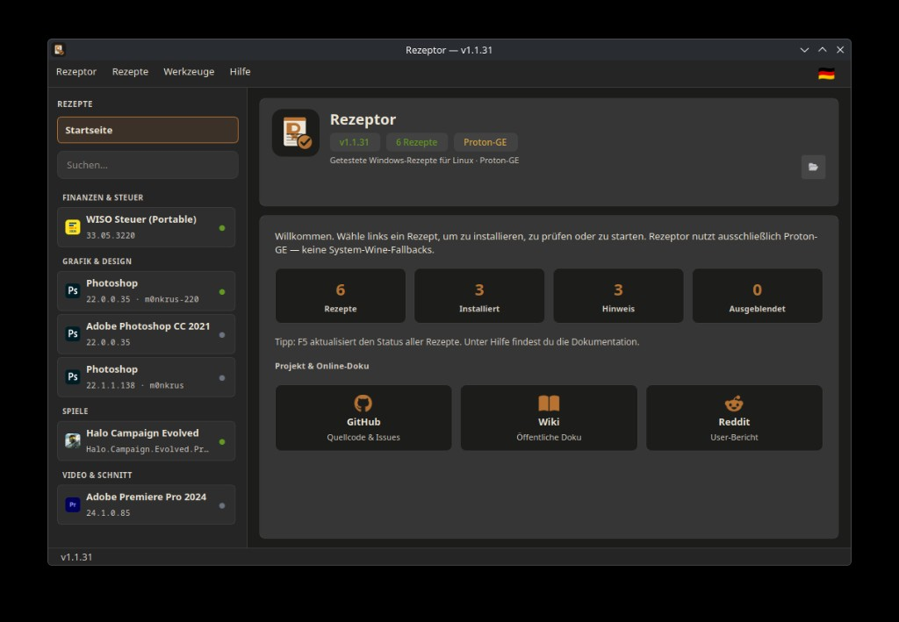

<p align="center">
  
</p>

<h1 align="center">Rezeptor</h1>

<p align="center">
  <strong>Windows-Software unter Linux installieren und starten</strong> —<br>
  mit getesteten Rezepten, <strong>Proton-GE</strong> und einer einfachen Desktop-Oberfläche.
</p>

<p align="center">
  <a href="https://github.com/benjarogit/rezeptor/releases"></a>
  <a href="LICENSE"></a>
  <a href="https://benjarogit.github.io/rezeptor/"></a>
  
  <a href="https://www.reddit.com/r/photoshop/comments/1vau4wh/fyi_photoshop_cc_2021_on_ubuntu_finally/"></a>
</p>

<p align="center">
  <a href="https://github.com/benjarogit/rezeptor/stargazers"></a>
  <a href="https://github.com/benjarogit/rezeptor/issues"></a>
  <a href="https://github.com/benjarogit/rezeptor/commits/main"></a>
  <a href="https://github.com/benjarogit/rezeptor/releases"></a>
</p>

Photoshop, Steuerprogramme (WISO), Steam-Spiele mit Online-Fix, Trainer und mehr: Jedes Rezept weiß, wie Installation, Reparatur, Prüfung, Start und saubere Deinstallation funktionieren.

> **Nachfolgeprojekt.**  
> Weiterentwicklung nur noch hier. Die älteren Repositories
> [photoshopCClinux](https://github.com/benjarogit/photoshopCClinux),
> [wiso-steuer-portable-linux](https://github.com/benjarogit/wiso-steuer-portable-linux) und
> [crkcachy](https://github.com/benjarogit/crkcachy)
> sind archiviert — Issues und PRs bitte in **diesem** Repo öffnen.

Support weiterhin über [GitHub Issues](https://github.com/benjarogit/rezeptor/issues) (nicht über Reddit).

## Was du bekommst

- **GUI-Launcher** — Rezept wählen, installieren, starten, reparieren oder entfernen
- **Nur Proton-GE** — kein System-Wine-Fallback in Rezepten
- **Statusprüfung** — optional beim Start; jederzeit neu prüfen (F5)
- **System-Tools** — fehlende Pakete einmalig vorschlagen
- **Katalog & Quellen** — offizielle Rezepte plus Community-Pfad
- **Rezept-Sync** — neue/aktualisierte offizielle Rezepte vom Release-Bundle (Hilfe → Rezepte aktualisieren)
- **Daten unter** `~/.local/share/wine-software/`



## Schnellstart

```bash
git clone https://github.com/benjarogit/rezeptor.git
cd rezeptor
./setup.sh
```

Benötigt **PyQt6** auf dem Host (`python-pyqt6` unter Arch/CachyOS bzw. Distro-Paket) bei **Git-Clone** oder **`tar.gz`**-Release (`./setup.sh`).

Das **`AppImage`** bringt eigenes Python und PyQt6 mit — kein hostseitiges `python-pyqt6` nötig (empfohlen auf Bazzite und anderen immutable Distros).

Das **`Flatpak`** bringt Python, PyQt6 und Proton-GE ebenfalls mit. Installation aus dem Release-Bundle:

```bash
flatpak install --user rezeptor-<version>-x86_64.flatpak
flatpak run io.github.benjarogit.Rezeptor
```

Oder lokal bauen: `scripts/build-flatpak.sh` (benötigt `flatpak-builder`).

Oder ein **[Release](https://github.com/benjarogit/rezeptor/releases)** (`tar.gz`, AppImage oder Flatpak). Portable Builds prüfen mit `sha256sum -c SHA256SUMS` (tar.gz + AppImage).

## Dokumentation

### → [Rezeptor Docs](https://benjarogit.github.io/rezeptor/)

- [Deutsch](https://benjarogit.github.io/rezeptor/) · [English](https://benjarogit.github.io/rezeptor/en/)
- Lokal: `pip install -r requirements-docs.txt && mkdocs serve`

## Rezepte

<details>
<summary><strong>Mitgelieferte offizielle Rezepte</strong> (8 — zum Aufklappen)</summary>

| ID | Name | Kategorie | Hinweis |
|----|------|-----------|---------|
| `photoshop` | Adobe Photoshop CC 2021 | Grafik & Design | Standard-Offline-Installer (22.0.0.35) |
| `photoshop-m0nkrus-220` | Adobe Photoshop CC 2021 (m0nkrus 22.0.0.35) | Grafik & Design | ISO-only-m0nkrus-Pack (nicht Standard / nicht 22.1.1.138) |
| `photoshop-m0nkrus` | Adobe Photoshop CC 2021 (m0nkrus 22.1.1.138) | Grafik & Design | Vollpack + Neural / missing_libs / GenP (optional) |
| `premiere` | Adobe Premiere Pro 2024 | Video & Schnitt | NVIDIA: CUDA via nvidia-libs |
| `wiso-steuer` | WISO Steuer (Portable) | Finanzen & Steuer | Portable unter Proton-GE |
| `halo-campaign-evolved` | Halo Campaign Evolved | Spiele | Pack MULTi13-ElAmigos + nummerierte Updates |

</details>

Volle Liste nach Kategorien: [Rezept-Katalog (Doku)](https://benjarogit.github.io/rezeptor/de/CATALOG/). Index: [`recipes/catalog.json`](recipes/catalog.json).

| Ort | Rolle |
|-----|--------|
| `recipes/<id>/` | Mitgeliefert / offiziell |
| `recipes/community/<id>/` | Community |

Ideen einreichen über [Recipe Submission](https://github.com/benjarogit/rezeptor/issues/new?template=recipe_submission.md).

## Rezepte beitragen & Rezeptor verbessern

Rezeptor wächst durch **erprobte Rezepte** und **gemeinsame Core-Logik** — ein eigener Fork ist nicht nötig.

| Ziel | Einstieg |
|------|----------|
| **Neues Rezept** (App/Spiel, das bei dir läuft) | [Entwickler-Doku](https://benjarogit.github.io/rezeptor/de/ENTWICKLER/) · `./scripts/new-recipe.sh` · `recipes/community/<id>/` |
| **Core/Launcher verbessern** (Prefix, validate, install_steps, GUI) | [CORE-API](https://benjarogit.github.io/rezeptor/de/CORE-API/) · [RECIPE-AUTHORING](https://benjarogit.github.io/rezeptor/de/RECIPE-AUTHORING/) |
| **Idee ohne sofortigen PR** | [Recipe-Submission-Issue](https://github.com/benjarogit/rezeptor/issues/new?template=recipe_submission.md) oder [Discussion](https://github.com/benjarogit/rezeptor/discussions) |

PRs mit funktionierendem Rezept **oder** wiederverwendbarer `core/`-/Launcher-Logik sind gleichermaßen willkommen. Vor dem PR: `./scripts/recipe-lint.sh` und `make recipes-check`.

## Versionierung

Releases folgen **SemVer** (`MAJOR.MINOR.PATCH`). Aktuell: **1.1.21**.

## English

→ [README.md](README.md) · [Documentation](https://benjarogit.github.io/rezeptor/en/README/)

## Lizenz

GPL-2.0 — siehe [LICENSE](LICENSE).
