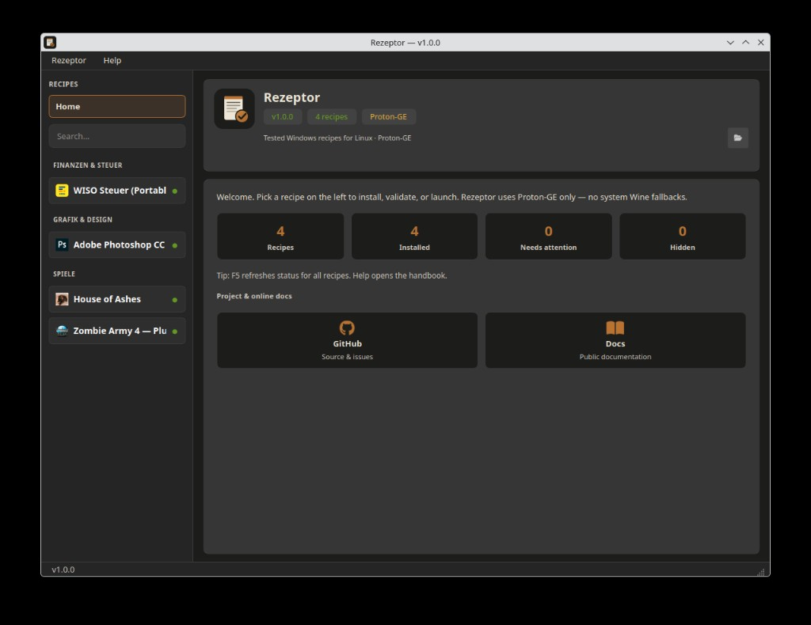

<p align="center">
  
</p>

# Rezeptor

**Install and run Windows software on Linux** with tested recipes — powered by **Proton-GE**, managed in a simple desktop app.

Photoshop, tax software (WISO), Steam games with online fixes, trainers, and more: each recipe knows how to install, repair, validate, launch, and uninstall cleanly.

[](https://benjarogit.github.io/rezeptor/)
[](LICENSE)
[](https://github.com/benjarogit/rezeptor/releases)

> **This is the successor project.**  
> Development continues here only. The older repositories
> [photoshopCClinux](https://github.com/benjarogit/photoshopCClinux) and
> [wiso-steuer-portable-linux](https://github.com/benjarogit/wiso-steuer-portable-linux)
> are archived — please open new issues and pull requests in **this** repo.

## What you get

- **GUI launcher** — pick a recipe, install, start, repair, or remove
- **Proton-GE only** — no system Wine fallback in recipes
- **Status checks** — optional validate on startup; refresh anytime (F5)
- **Host tools check** — missing packages suggested once
- **Catalog & sources** — official recipes plus a community path
- **Data under** `~/.local/share/wine-software/`



## Quick start

```bash
git clone https://github.com/benjarogit/rezeptor.git
cd rezeptor
./setup.sh
```

Needs **PyQt6** on the host (`python-pyqt6` on Arch/CachyOS, or your distro’s package) when you use **git clone** or the **`tar.gz`** release (`./setup.sh`).

The **`AppImage`** bundles its own Python and PyQt6 — no host `python-pyqt6` required (recommended on Bazzite and other immutable distros).

The **`Flatpak`** also bundles Python, PyQt6, and Proton-GE. Install from a release bundle:

```bash
flatpak install --user rezeptor-<version>-x86_64.flatpak
flatpak run io.github.benjarogit.Rezeptor
```

Or build locally: `scripts/build-flatpak.sh` (needs `flatpak-builder`).

Or download a **[release](https://github.com/benjarogit/rezeptor/releases)** (`tar.gz`, AppImage, or Flatpak). Verify portable builds with `sha256sum -c SHA256SUMS` (tar.gz + AppImage).

## Documentation

### → [Rezeptor Docs](https://benjarogit.github.io/rezeptor/)

- [Deutsch](https://benjarogit.github.io/rezeptor/) · [English](https://benjarogit.github.io/rezeptor/en/)
- Local: `pip install -r requirements-docs.txt && mkdocs serve`

## Recipes

| Location | Role |
|----------|------|
| `recipes/<id>/` | Bundled / official |
| `recipes/community/<id>/` | Community |

Submit ideas via [Recipe Submission](https://github.com/benjarogit/rezeptor/issues/new?template=recipe_submission.md).

## Versioning

Releases follow **SemVer** (`MAJOR.MINOR.PATCH`). Current line starts at **1.0.2**.

## Deutsch

→ [README.de.md](README.de.md) · [Dokumentation](https://benjarogit.github.io/rezeptor/de/README/)

## License

GPL-2.0 — see [LICENSE](LICENSE).
