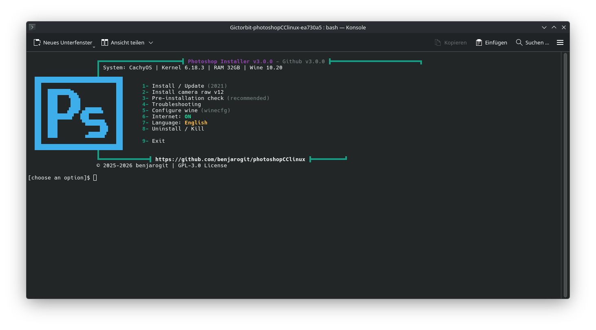

# Adobe Photoshop Installer for Linux 

> [!NOTE]
> **Production Ready - Complete Toolset**
> 
> This project has evolved from a simple installer into a **comprehensive, production-ready toolset** for running Photoshop on Linux. With modular architecture, extensive features, and professional polish, it's ready for widespread use.
> 
> **Every hint, fix, or idea is welcome!** Please report issues, share solutions, or contribute improvements via [GitHub Issues](https://github.com/benjarogit/rezeptor/issues).
> 
> See [CHANGELOG.md](CHANGELOG.md) for latest changes!

> [!IMPORTANT]
> **Tested and Working Versions**
> 
> ✅ **Adobe Photoshop CC 2021 (v22.x)** and **WISO Steuer** — both Proton-GE. Runtime is per-recipe via `recipe.yml`.

> **Data directory**: `~/.local/share/wine-software/photoshop/` (prefix, resources). Runtime: `~/.local/share/wine-software/runtime/proton-ge/`.

> **Launcher**: PyQt6 required (`python-pyqt6`). `./setup.sh` → GUI; no bash menu fallback.
> 
> **Note about version numbers**: The specific version I tested is **v22.0.0.35**, but **any Photoshop v22.x version should work**. The exact build number may vary depending on where you obtained your installation files.
> 
> 💡 **Important**: Only CC 2021 (v22.x) has been tested. Other versions have not been tested.
> 
> 
> ✅ **Tested on**: CachyOS Linux (Arch-based) with KDE desktop environment


     

**Run Adobe Photoshop natively on Linux using Wine**

A simple, automated installer that helps you set up Photoshop on Linux. Works on CachyOS, Arch, Ubuntu, Fedora, and all major Linux distributions.

---

## 🌍 Languages / Sprachen

- 🇬🇧 **[English Documentation](#english-documentation)** - See below
- 🇩🇪 **[Deutsche Dokumentation](README.de.md)** - Vollständige Anleitung

---

# English Documentation

## 📋 Table of Contents

- [Features](#-features)
- [System Requirements](#-system-requirements)
- [Important Notice](#-important-notice)
- [Quick Start](#-quick-start)
- [Installation Guide](#-installation-guide)
- [Known Issues & Solutions](#-known-issues--solutions)
- [Troubleshooting](#-troubleshooting)
- [Performance Tips](#-performance-tips)
- [Uninstallation](#-uninstallation)
- [Contributing](#-contributing)
- [License](#-license)

---

## ✨ Features

### Core Installation
- ✅ **Local Installation** - Uses local installation files (no downloads from Adobe)
- ✅ **Automatic Setup** - Installs Wine components and dependencies automatically
- ✅ **Multi-Distribution Support** - Works on CachyOS, Arch, Ubuntu, Fedora, and more
- ✅ **Pre-Installation Check** - Validates system before installation with distro-specific hints
- ✅ **Desktop Integration** - Creates menu / desktop entry
- ✅ **Multi-Language** - Full i18n support (DE/EN) with external language files

### Advanced Features
- 🔧 **Automatic Troubleshooting** - Built-in diagnostic tools with automatic fixes
- 📦 **Camera Raw Installer** - Automated installation with MD5 verification
- 🔄 **Update Check System** - GitHub API integration with caching and timeout protection
- 💾 **Checkpoint/Rollback** - Safe installation with recovery points
- 🔒 **Security Module** - Path validation, safe operations, shell injection prevention
- 📊 **System Information** - Cross-distro system detection and reporting
- 🎨 **Responsive UI** - Banner, boxes, and headers adapt to terminal width
- 🔇 **Quiet/Verbose Modes** - `--quiet` / `-q` and `--verbose` / `-v` flags for CI/testing
- 📝 **Log Rotation** - Automatic compression (gzip) and cleanup of old logs
- 🚀 **File Opening Support** - Launcher accepts files as parameters ("Open with Photoshop")
- ⚙️ **Wine Configuration** - Optional winecfg helper (Proton prefix; not required for install)
- 🛑 **Kill utility** - Force termination of stuck processes
- 🎯 **GPU Workarounds** - Fixes for common graphics issues

---

## 🖥️ System Requirements

### Required

- **OS:** 64-bit Linux distribution
- **RAM:** Minimum 4 GB (8 GB recommended)
- **Storage:** 5 GB free space in `/home`
- **Graphics:** Any GPU (Intel, Nvidia, AMD) with up-to-date drivers

### Required packages (host)

Rezeptor uses **Proton-GE only** (pinned in `core/runtime.lock`) — **no system Wine**. Host needs:

- `python-pyqt6` (or distro equivalent) for the GUI
- Common tools: `curl`/`wget`, `cabextract`, `unzip` (winetricks helper deps as needed)

Proton-GE is downloaded/managed under `~/.local/share/wine-software/runtime/proton-ge/`. Do **not** install system `wine` as the runtime.

<details>
<summary><b>Example: CachyOS / Arch (GUI + helpers)</b></summary>

```bash
sudo pacman -S python-pyqt6 cabextract unzip curl
```
</details>

<details>
<summary><b>Example: Ubuntu / Debian</b></summary>

```bash
sudo apt install python3-pyqt6 cabextract unzip curl
```
</details>

<details>
<summary><b>Example: Fedora</b></summary>

```bash
sudo dnf install python3-pyqt6 cabextract unzip curl
```
</details>

---

## ⚠️ Important Notice

### You Must Provide Photoshop Installation Files

**This repository does NOT include Photoshop installation files.**

You must:
1. **Own a valid Adobe Photoshop CC 2021 license**
2. **Obtain the installer yourself** (see [How to Get Photoshop](#how-to-get-photoshop-files))
3. **Place files in `photoshop/` directory** (see [photoshop/README.md](photoshop/README.md))

### ⚡ Version Compatibility

| Status | Version |
|--------|---------|
| **Guaranteed** | Adobe Photoshop CC 2021 **v22.0.0.35** |
| Best effort | Other **v22.x** builds (may show UI/installer issues) |
| Not supported | v21, v23+, CC 2019 and older |

### Installation tiers

| Tier | Audience | Method |
|------|----------|--------|
| **1** | End users, Fedora Silverblue / Bazzite / immutable | [GitHub Release AppImage](https://github.com/benjarogit/rezeptor/releases) |
| **2** | Arch / CachyOS / Pop!\_OS / developers | `git clone` + `python-pyqt6` + `./setup.sh` |
| **3** | Immutable (Silverblue, Bazzite, Kinoite, Bluefin) | AppImage from Releases (Proton + PyQt6 bundled; no host PyQt6) |

Runtime: pinned [Proton-GE](https://github.com/GloriousEggroll/proton-ge-custom) (`core/runtime.lock`), under `~/.local/share/wine-software/runtime/proton-ge/`.

### How to Get Photoshop Files

#### Option 1: Official Adobe (Recommended)
- Download from Adobe Creative Cloud
- Get offline installer for Photoshop CC 2021 (v22.x)

#### Option 2: Existing Installation
- If you have Photoshop on Windows, extract installation files
- Windows location: `C:\Program Files\Adobe\Adobe Photoshop CC 2021\`

**⚖️ Legal:** You must have a valid license. This script only automates Wine installation.

---

## 🚀 Quick Start

### Tier 1: AppImage (recommended for immutable distros)

1. Download `rezeptor-<version>-x86_64.AppImage` from [Releases](https://github.com/benjarogit/rezeptor/releases)
2. `chmod +x rezeptor-*.AppImage`
3. Double-click (or run from a terminal). The Rezeptor GUI opens immediately — no terminal prompt.
4. In the GUI, install Photoshop and pick the folder that contains your `Set-up.exe` (BYOS; Adobe files are not bundled).

PyQt6, Fluent Widgets, and Proton-GE are bundled in the AppImage. No system Wine or host `python-pyqt6` required for the AppImage path. The AppImage is the same code as a git checkout + `./setup.sh` — rebuild with `scripts/build-appimage.sh` after changes.

### Tier 2: Git clone

### 1. Clone Repository

```bash
git clone https://github.com/benjarogit/rezeptor.git
cd photoshopCClinux
```

### 2. Place Photoshop Files

Copy your Photoshop CC 2021 installation files to `photoshop/` directory:

```
photoshop/
├── Set-up.exe
├── packages/
└── products/
```

See [photoshop/README.md](photoshop/README.md) for detailed structure.

### 3. Run Pre-Check

```bash
chmod +x pre-check.sh
./pre-check.sh
```

Should show: ✅ "All critical checks passed!"

### 4. Disable Internet (Recommended)

```bash
# WiFi
nmcli radio wifi off

# Or Ethernet
sudo ip link set <interface> down
```

This prevents Adobe login prompts during installation.

### 5. Run Installation

```bash
chmod +x setup.sh
./setup.sh
```

### 6. In Rezeptor installieren

```bash
./setup.sh
```

1. Rezept **Adobe Photoshop CC 2021** wählen  
2. **Installieren** — Offline-Installer liegt unter `photoshop/` (`fixed_path`, kein Quell-Dialog)  
3. Bestätigen und warten (10–20 Minuten)



### 7. In Adobe Setup Window

- Click "Install"
- Keep default path (`C:\Program Files\Adobe\...`)
- Select your language (e.g., en_US or de_DE)
- Wait 10-20 minutes

### 8. Re-enable Internet

```bash
nmcli radio wifi on
```

### 9. Launch Photoshop

```bash
photoshop
```

Or search for "Adobe Photoshop CC" in your application menu.

### 10. GPU (automatisch aus)

Rezeptor setzt GPU/OpenGL in Prefs und `PSUserConfig.txt` automatisch aus (sonst „Programmfehler“ bei Neu/Text). Bei Problemen: **Reparieren**. Manuell prüfen: `Bearbeiten → Voreinstellungen → Leistung` — „Grafikprozessor verwenden“ sollte aus sein.

---

## ⚙️ Command Line

| Command | Purpose |
|---------|---------|
| `./setup.sh` | Pre-check + Rezeptor GUI |
| `./setup.sh --dev` | Dev-Modus (Rezepte ohne Manifest) |
| `bash recipes/photoshop/install.sh` | Photoshop install (CLI) |
| `bash recipes/photoshop/launch.sh` | Start Photoshop |
| `bash recipes/photoshop/kill.sh` | Kill Photoshop processes |
| `bash recipes/photoshop/uninstall.sh` | Remove installation |

Logs: `~/.local/share/wine-software/logs/`

### Recipe system

Each app under `recipes/<id>/` is a **recipe**: `recipe.yml` (contract + declarative `install_steps`) + thin hooks that call `core/recipe-hooks.sh`. Shared logic lives in `core/`; integrity is enforced by `recipes/manifest.json` and `./scripts/recipe-lint.sh` (CI).

- Quick start: [docs/en/ENTWICKLER.md](docs/en/ENTWICKLER.md) · German: [docs/de/ENTWICKLER.md](docs/de/ENTWICKLER.md)
- Full spec: [docs/en/RECIPE-AUTHORING.md](docs/en/RECIPE-AUTHORING.md)
- Translations: [docs/CONTRIBUTING-TRANSLATIONS.md](docs/CONTRIBUTING-TRANSLATIONS.md)
- In GUI: **Help → Developer documentation…** · **Rezeptor → New recipe…**

---

## 📖 Installation Guide

### Detailed Steps

#### Pre-Installation

1. **Install host packages** (PyQt6 + helpers — see [Required packages](#required-packages-host)). No system Wine.

2. **Check System**
   ```bash
   ./pre-check.sh
   ```
   
   This validates:
   - 64-bit architecture
   - Available disk space / RAM
   - Installation files presence
   - Proton-GE / recipe readiness (not system Wine)

#### During Installation

1. **Rezeptor GUI** — `./setup.sh` → Photoshop → Install. Components (win10, fonts, msxml, gdiplus, IE8, VC++ redist) are applied automatically via Proton-GE.

2. **Adobe Photoshop Setup** (10-20 minutes)
   - Adobe installer window appears
   - Click "Install"
   - Choose language
   - Wait for completion
   - **Ignore** "ARKServiceAdmin" errors if they appear

You do **not** need a manual Mono/Gecko/winecfg walkthrough — Rezeptor configures the prefix.
#### Post-Installation

1. **Run Troubleshoot**
   ```bash
   ./troubleshoot.sh
   ```

2. **Launch Photoshop**
   ```bash
   photoshop
   ```
   
   First launch takes 1-2 minutes (normal!)

3. **GPU** — Rezeptor deaktiviert GPU/OpenGL automatisch. Bei Problemen: Reparieren.

---


---

## 🐛 Known Issues & Solutions

### Issue 1: Photoshop Crashes on Startup

**Cause:** GPU acceleration incompatibility with Wine

**Solution:** Rezeptor setzt GPU/OpenCL bereits aus (`PSUserConfig.txt` + Prefs). Falls noch aktiv: **Reparieren**, dann in Photoshop unter *Bearbeiten → Voreinstellungen → Leistung* prüfen.
### Issue 2: "VCRUNTIME140.dll is missing"

**Cause:** Visual C++ Runtime not installed properly

**Solution:** Rezeptor → **Repair** (installs Microsoft VC++ redist via `recipe_vcrun::ensure`, not system winetricks).
### Issue 3: Liquify Tool Doesn't Work

**Cause:** GPU/OpenCL issues

**Solution:**
- Disable GPU acceleration (see Issue 1)
- Or disable OpenCL: Preferences > Performance > Uncheck "Use OpenCL"

### Issue 4: Blurry/Ugly Fonts

**Solution:** Rezeptor → **Repair** (fonts / fontsmooth are part of the recipe).
### Issue 5: Installation Hangs at 100%

**Solution:**
- Wait 2-3 minutes
- If nothing happens, close installer (Alt+F4)
- Installation is likely complete
- Verify: `ls ~/.local/share/wine-software/photoshop/prefix/drive_c/Program\ Files/Adobe/`

### Issue 6: "ARKServiceAdmin" Error During Installation

**Solution:**
- This error can be **ignored**
- Click "Ignore" or "Continue"
- Installation will complete successfully

### Issue 7: Slow First Startup (1-2 Minutes)

**Not an Issue:**
- First startup is always slow
- Subsequent starts take 10-30 seconds
- This is normal Wine behavior

### Issue 8: Cannot Save as PNG

**Cause:** File format plugin issue in Wine

**Solution:**
```
1. File > Save As
2. Choose "PNG" from format dropdown
3. If it fails, try: File > Export > Export As > PNG
4. Alternative: Save as PSD, then use GIMP to export as PNG
```

### Issue 9: Screen Doesn't Update Immediately (Undo/Redo)

**Cause:** Wine rendering lag

**Solution:**
- This is a known Wine limitation
- Workaround: Force refresh with Ctrl+0 (fit to screen)
- Prefer Rezeptor → Repair over enabling Virtual Desktop (VD often shows a blue desktop and is not the default)
### Issue 10: Zooming is Laggy

**Cause:** GPU acceleration disabled + Wine overhead

**Solution:**
```
1. Use keyboard shortcuts (Ctrl + / Ctrl -)
2. Zoom with mouse wheel is slower than native
3. This is expected behavior with Wine
4. Prefer keyboard zoom; Rezeptor uses Proton-GE (not wine-staging)
```

### Issue 11: Adobe Installer "Next" Button Doesn't Respond

**Cause:** Adobe installer uses Internet Explorer engine (mshtml.dll) which doesn't work perfectly in Wine

**Solution:**
```
1. Install IE8 when prompted (takes 5-10 minutes, but significantly helps)
2. Wait 15-30 seconds - installer sometimes loads slowly
3. Use keyboard navigation:
   - Tab key multiple times to focus the button
   - Press Enter to click
   - Or: Alt+N (Next) / Alt+W (Weiter in German)
4. Click directly on the button (not beside it)
5. Bring installer window to foreground (Alt+Tab)
6. If nothing works: Rezeptor → **Repair**, or re-run the Photoshop recipe install
```

**Note:** This is a known limitation of Wine with IE-based installers. The installer has already configured DLL-overrides and registry tweaks to improve compatibility.

---

## 🔧 Troubleshooting

### Automatic Troubleshooting

```bash
./troubleshoot.sh
```

This tool:
- ✅ Checks system requirements
- ✅ Validates installation
- ✅ Analyzes Wine configuration
- ✅ Scans logs for errors
- ✅ Applies automatic fixes when possible
- ✅ Provides detailed reports

### Manual Troubleshooting

#### Check Logs

```bash
# All logs are stored in:
ls ~/.local/share/wine-software/logs/

# View latest log
tail -n 50 ~/.local/share/wine-software/logs/*.log | tail -50
```

#### Wine / prefix settings

Prefer **Rezeptor → Repair** over raw winecfg. If you must inspect the prefix, use Proton-GE via the project helpers (not system `/usr/bin/winecfg`).

Rezeptor defaults:
- **Windows Version:** Windows 10
- **Virtual Desktop:** off (enable only as last resort for fullscreen quirks)

#### Reinstall components

Use Rezeptor → **Repair** for the Photoshop recipe. Manual winetricks against system Wine is unsupported.
---

## 🚀 Performance Tips

### Essential (For Stability)

1. **GPU/OpenCL aus** — Rezeptor setzt das automatisch; bei Drift: Reparieren
2. **Mehrthread-Composing** (ohne GPU): *Bearbeiten → Voreinstellungen → Leistung* manuell an

### Optional (For Speed)

3. **CSMT** (bereits in Rezept-Registry)
   ```bash
   # nur falls nötig manuell:
   WINEPREFIX=~/.local/share/wine-software/photoshop/prefix wine reg query "HKCU\\Software\\Wine\\Direct3D"
   ```

4. **Kein Virtual Desktop** — Rezeptor lässt VD aus (blaue Fläche). Opt-in only as last resort.
### Expected Performance

| Feature | Native Windows | Wine Linux | Notes |
|---------|---------------|------------|-------|
| Basic Tools | 100% | 90-95% | Excellent |
| Filters | 100% | 80-90% | Good |
| Liquify | 100% | 70-80% | Usable (GPU off) |
| 3D Features | 100% | 30-50% | Limited |
| Camera Raw | 100% | 60-80% | Usable |
| Startup Time | 5-10s | 10-30s | After first launch |

**Overall:** 85-90% of native performance for standard photo editing.

---

## 🗑️ Uninstallation

### Via Rezeptor

`./setup.sh` → Photoshop → **Deinstallieren** (falls im Rezept verfügbar)

### CLI / manual

```bash
bash recipes/photoshop/uninstall.sh
# or
bash recipes/photoshop/kill.sh   # stuck processes only
```

Removes prefix (`~/.local/share/wine-software/photoshop/`), desktop entry, and launcher symlinks where applicable.

### Manual removal

```bash
# Remove installation
rm -rf ~/.local/share/wine-software/photoshop/

# Remove desktop entry
rm -f ~/.local/share/applications/photoshop.desktop
```

There is no product `photoshop` CLI — start via Rezeptor or the desktop entry.
---

## 🤝 Contributing

**We need your help!** This project is made better by contributions from the community.

### How You Can Help

#### 🐛 Report Bugs
Found something that doesn't work? Let us know!
- [Open a GitHub Issue](https://github.com/benjarogit/rezeptor/issues)
- Include: Linux distro, Wine version, error logs, steps to reproduce
- Even if you're not sure it's a bug - report it anyway!

#### 💡 Suggest Features
Have an idea to make this better?
- [Open a Feature Request](https://github.com/benjarogit/rezeptor/issues)
- Describe what you'd like to see
- Explain why it would be helpful

#### 🔧 Share Fixes & Workarounds
Found a solution to a problem?
- Share it in the [GitHub Issues](https://github.com/benjarogit/rezeptor/issues)
- Help others who have the same problem
- Your experience helps everyone!

#### 📝 Improve Documentation
Found something unclear in the README?
- [Open an Issue](https://github.com/benjarogit/rezeptor/issues) or submit a pull request
- Help make this easier for beginners
- Translate to other languages

#### 💻 Code Contributions
Want to contribute code?
1. Fork the repository
2. Create a feature branch
3. For new apps: see [docs/RECIPE-AUTHORING.md](docs/RECIPE-AUTHORING.md) and `recipes/_template/`
4. Test your changes thoroughly
4. Submit a pull request with a clear description

**Every contribution, big or small, makes this project better! 🙏**

---

## 📚 Additional Resources

### Official Resources

- **German Documentation:** [README.de.md](README.de.md)
- **Changelog:** [CHANGELOG.md](CHANGELOG.md) - See latest changes and previous versions
- **Quick Start Guide:** Quick start section above

### Alternative Solutions

If this installer doesn't work for you, consider these alternatives:

- **[PhotoGIMP](https://github.com/Diolinux/PhotoGIMP)** - GIMP configured to look/feel like Photoshop
- **[Krita](https://krita.org/)** - Professional painting and illustration (native Linux)
- **[Photopea](https://www.photopea.com/)** - Online Photoshop alternative (browser-based)

### Original Project

- [Original Gictorbit Project](https://github.com/Gictorbit/photoshopCClinux) - Based on this project

---

## 📄 License

This project is licensed under the **GPL-2.0 License** - see the [LICENSE](LICENSE) file for details.

### Legal Notice

- ⚠️ Adobe Photoshop is proprietary software owned by Adobe Inc.
- ⚠️ You must have a valid license to use Photoshop
- ⚠️ This script only automates Wine installation
- ⚠️ No piracy is supported or encouraged
- ✅ Use at your own risk

---

## 🙏 Acknowledgments

- **[Gictorbit](https://github.com/Gictorbit)** - Original installer script
- **Wine Team** - Windows compatibility layer
- **Community Contributors** - Bug reports and fixes

---

## 📊 Project Status


**Status:** ✅ Production Ready (Complete Toolset)

**Tested on:**
- CachyOS Linux (Arch-based) with KDE desktop environment

---

## ❓ FAQ

<details>
<summary><b>Q: Do I need an Adobe account?</b></summary>

You need a valid Photoshop license, but you can use the offline installer without logging in during installation. Disable internet connection during setup.
</details>

<details>
<summary><b>Q: Which Photoshop version works?</b></summary>

Only Photoshop CC 2021 (v22.x) has been tested and confirmed working. Other versions have not been tested.
</details>

<details>
<summary><b>Q: Can I use plugins?</b></summary>

Most plugins work. Install them to: `~/.local/share/wine-software/photoshop/prefix/drive_c/Program Files/Adobe/Adobe Photoshop CC 2021/Plug-ins/`
</details>

<details>
<summary><b>Q: Does Camera Raw work?</b></summary>

Yes! After Photoshop installation:

```bash
bash recipes/photoshop/optional/cameraRawInstaller.sh
```
</details>

<details>
<summary><b>Q: Why is GPU disabled?</b></summary>

Wine/Proton: GPU an bricht oft Neu/Text-Tool. Rezeptor deaktiviert GPU automatisch (`PSUserConfig.txt`, MachinePrefs, Registry).
</details>

<details>
<summary><b>Q: Can I use other Photoshop versions?</b></summary>

Only CC 2021 (v22.x) has been tested. Other versions may or may not work - they have not been tested.
</details>

---

## 💬 Support

- 🐛 **Bug Reports:** [GitHub Issues](https://github.com/benjarogit/rezeptor/issues)
- 💡 **Feature Requests:** [GitHub Issues](https://github.com/benjarogit/rezeptor/issues)
- 📖 **Documentation:** See files in this repository
- 🔧 **Automatic Help:** Run `./troubleshoot.sh`

---

## 📄 License & Copyright

**Copyright © 2024-2026 Sunny C.**

This project is licensed under the **GPL-2.0 License**.

Based on [photoshopCClinux](https://github.com/Gictorbit/photoshopCClinux) by Gictorbit.

---

**Made with ❤️ for the Linux community**

**Star ⭐ this repo if it helped you!**


