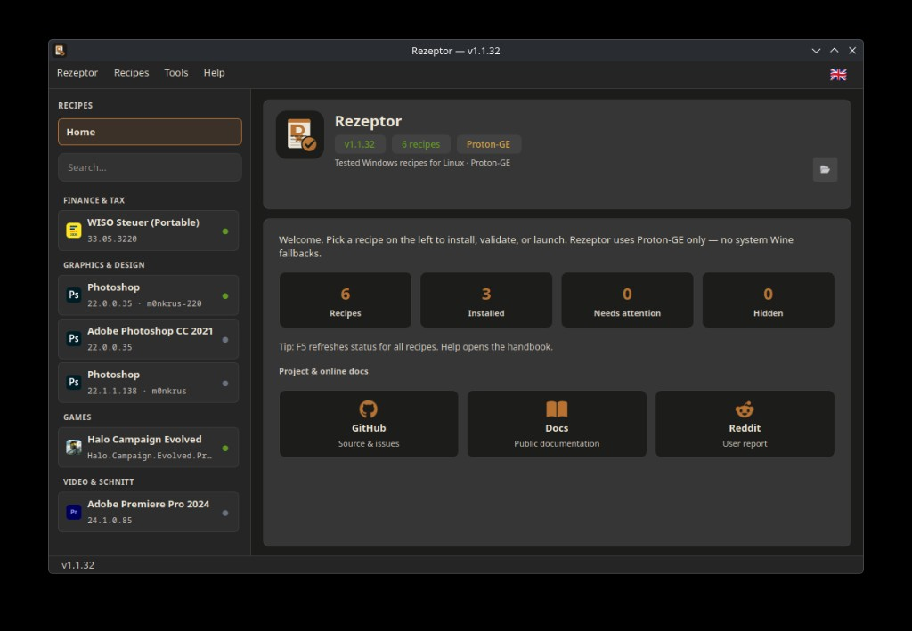

<p align="center">
  
</p>

<h1 align="center">Rezeptor</h1>

<p align="center">
  <strong>Install and run Windows software on Linux</strong> with tested recipes —<br>
  powered by <strong>Proton-GE</strong>, managed in a simple desktop app.
</p>

<p align="center">
  <a href="https://github.com/benjarogit/rezeptor/releases"></a>
  <a href="LICENSE"></a>
  <a href="https://benjarogit.github.io/rezeptor/"></a>
  
  
  <a href="https://www.reddit.com/r/photoshop/comments/1vau4wh/fyi_photoshop_cc_2021_on_ubuntu_finally/"></a>
</p>

<p align="center">
  <a href="https://github.com/benjarogit/rezeptor/stargazers"></a>
  <a href="https://github.com/benjarogit/rezeptor/issues"></a>
  <a href="https://github.com/benjarogit/rezeptor/commits/main"></a>
  <a href="https://github.com/benjarogit/rezeptor/releases"></a>
</p>

Photoshop, tax software (WISO), Steam games with online fixes, trainers, and more: each recipe knows how to install, repair, validate, launch, and uninstall cleanly.

> **Experimental.** Rezeptor is under active development. A lot is changing under the hood, so a fix can creep back in after a refactor. That will happen again. Issues help. I am doing my best.

> **This is the successor project.**  
> Development continues here only. The older repositories
> [photoshopCClinux](https://github.com/benjarogit/photoshopCClinux),
> [wiso-steuer-portable-linux](https://github.com/benjarogit/wiso-steuer-portable-linux), and
> [crkcachy](https://github.com/benjarogit/crkcachy)
> are archived — please open new issues and pull requests in **this** repo.

Support stays on [GitHub Issues](https://github.com/benjarogit/rezeptor/issues) (not Reddit).

## What you get

- **GUI launcher** — pick a recipe, install, start, repair, or remove
- **Proton-GE only** — no system Wine fallback in recipes; default pin in `core/runtime.lock`, optional per-recipe `proton_ge_tag` (Photoshop and Halo use GE 11)
- **Status checks** — optional validate on startup; refresh anytime (F5)
- **Host tools check** — missing packages suggested once
- **Catalog & sources** — official recipes plus a community path
- **Recipe sync** — pull new/updated official recipes from the release bundle (Help → Update recipes)
- **Data under** `~/.local/share/wine-software/`



## Quick start

```bash
git clone https://github.com/benjarogit/rezeptor.git
cd rezeptor
./setup.sh
```

Needs **PyQt6** on the host (`python-pyqt6` on Arch/CachyOS, or your distro’s package) when you use **git clone** or the **`tar.gz`** release (`./setup.sh`).

The **`AppImage`** bundles its own Python and PyQt6 — no host `python-pyqt6` required (recommended on Bazzite and other immutable distros).

The **`Flatpak`** also bundles Python, PyQt6, and Proton-GE. Install from a release bundle:

```bash
flatpak install --user rezeptor-<version>-x86_64.flatpak
flatpak run io.github.benjarogit.Rezeptor
```

Or build locally: `scripts/build-flatpak.sh` (needs `flatpak-builder`).

Or download a **[release](https://github.com/benjarogit/rezeptor/releases)** (`tar.gz`, AppImage, or Flatpak). Verify portable builds with `sha256sum -c SHA256SUMS` (tar.gz + AppImage).

## Documentation

### → [Rezeptor Docs](https://benjarogit.github.io/rezeptor/)

- [Deutsch](https://benjarogit.github.io/rezeptor/) · [English](https://benjarogit.github.io/rezeptor/en/)
- Local: `pip install -r requirements-docs.txt && mkdocs serve`

## Recipes

<details>
<summary><strong>Bundled official recipes</strong> (6 — click to expand)</summary>

| ID | Name | Category | Notes |
|----|------|----------|--------|
| `photoshop` | Adobe Photoshop CC 2021 | Graphics & Design | Standard offline installer (22.0.0.35) |
| `photoshop-m0nkrus` | Adobe Photoshop CC 2021 (m0nkrus 22.1.1.138) | Graphics & Design | Full pack + Neural / missing_libs / GenP (optional) |
| `premiere` | Adobe Premiere Pro 2024 | Video | NVIDIA: CUDA via nvidia-libs |
| `wiso-steuer` | WISO Steuer (Portable) | Finance | Portable under Proton-GE |
| `master-pdf-editor` | Master PDF Editor | Documents & PDF | BYOS MSI 5.9 under Proton-GE (optional fix/ in pack) |
| `halo-campaign-evolved` | Halo Campaign Evolved | Games | ElAmigos/RUNE · graphics presets · optional Steam Non-Steam · BYOS trainer |

</details>

Full list by category: [Recipe catalog (docs)](https://benjarogit.github.io/rezeptor/en/CATALOG/). Index: [`recipes/catalog.json`](recipes/catalog.json).

| Location | Role |
|----------|------|
| `recipes/<id>/` | Bundled / official |
| `recipes/community/<id>/` | Community |

Submit ideas via [Recipe Submission](https://github.com/benjarogit/rezeptor/issues/new?template=recipe_submission.md).

## Contribute recipes & improve Rezeptor

Rezeptor lives from **tested recipes** and a **shared core** — you do not need to maintain a fork.

| Goal | Start here |
|------|------------|
| **New recipe** (app/game you got running) | [Developer guide](https://benjarogit.github.io/rezeptor/en/ENTWICKLER/) · `./scripts/new-recipe.sh` · `recipes/community/<id>/` |
| **Fix or extend core logic** (prefix, validate, install steps, launcher) | [CORE-API](https://benjarogit.github.io/rezeptor/en/CORE-API/) · [RECIPE-AUTHORING](https://benjarogit.github.io/rezeptor/en/RECIPE-AUTHORING/) |
| **Idea without a PR yet** | [Recipe submission issue](https://github.com/benjarogit/rezeptor/issues/new?template=recipe_submission.md) or a short [discussion](https://github.com/benjarogit/rezeptor/discussions) |

Pull requests that add a working recipe **or** make `core/` / the launcher more reusable for the next recipe are equally welcome. Run `./scripts/recipe-lint.sh` and `make recipes-check` before opening a PR.

## Versioning

Releases follow **SemVer** (`MAJOR.MINOR.PATCH`). Current: **1.1.21**.

## Deutsch

→ [README.de.md](README.de.md) · [Dokumentation](https://benjarogit.github.io/rezeptor/de/README/)

## License

GPL-2.0 — see [LICENSE](LICENSE).
